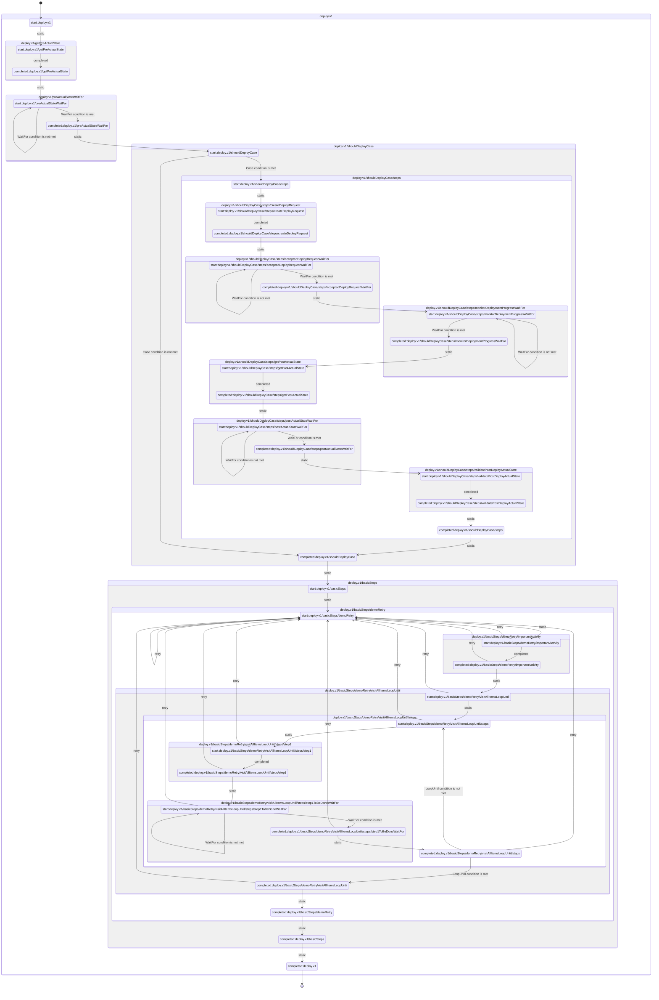

# Demo Steps
File generated via `go generate demo.go`

```mermaid
stateDiagram-v2
[*] --> start&colon;deploy.v1
completed&colon;deploy.v1 --> [*]
state deploy.v1 {
state deploy.v1/basicSteps {
state deploy.v1/basicSteps/demoRetry {
state deploy.v1/basicSteps/demoRetry/importantActivity {
start&colon;deploy.v1/basicSteps/demoRetry/importantActivity
completed&colon;deploy.v1/basicSteps/demoRetry/importantActivity
}
state deploy.v1/basicSteps/demoRetry/visitAllItemsLoopUntil {
state deploy.v1/basicSteps/demoRetry/visitAllItemsLoopUntil/steps {
state deploy.v1/basicSteps/demoRetry/visitAllItemsLoopUntil/steps/step1 {
start&colon;deploy.v1/basicSteps/demoRetry/visitAllItemsLoopUntil/steps/step1
completed&colon;deploy.v1/basicSteps/demoRetry/visitAllItemsLoopUntil/steps/step1
}
state deploy.v1/basicSteps/demoRetry/visitAllItemsLoopUntil/steps/step1ToBeDoneWaitFor {
start&colon;deploy.v1/basicSteps/demoRetry/visitAllItemsLoopUntil/steps/step1ToBeDoneWaitFor
completed&colon;deploy.v1/basicSteps/demoRetry/visitAllItemsLoopUntil/steps/step1ToBeDoneWaitFor
}
start&colon;deploy.v1/basicSteps/demoRetry/visitAllItemsLoopUntil/steps
completed&colon;deploy.v1/basicSteps/demoRetry/visitAllItemsLoopUntil/steps
}
start&colon;deploy.v1/basicSteps/demoRetry/visitAllItemsLoopUntil
completed&colon;deploy.v1/basicSteps/demoRetry/visitAllItemsLoopUntil
}
start&colon;deploy.v1/basicSteps/demoRetry
completed&colon;deploy.v1/basicSteps/demoRetry
}
start&colon;deploy.v1/basicSteps
completed&colon;deploy.v1/basicSteps
}
state deploy.v1/getPreActualState {
start&colon;deploy.v1/getPreActualState
completed&colon;deploy.v1/getPreActualState
}
state deploy.v1/preActualStateWaitFor {
start&colon;deploy.v1/preActualStateWaitFor
completed&colon;deploy.v1/preActualStateWaitFor
}
state deploy.v1/shouldDeployCase {
state deploy.v1/shouldDeployCase/steps {
state deploy.v1/shouldDeployCase/steps/acceptedDeployRequestWaitFor {
start&colon;deploy.v1/shouldDeployCase/steps/acceptedDeployRequestWaitFor
completed&colon;deploy.v1/shouldDeployCase/steps/acceptedDeployRequestWaitFor
}
state deploy.v1/shouldDeployCase/steps/createDeployRequest {
start&colon;deploy.v1/shouldDeployCase/steps/createDeployRequest
completed&colon;deploy.v1/shouldDeployCase/steps/createDeployRequest
}
state deploy.v1/shouldDeployCase/steps/getPostActualState {
start&colon;deploy.v1/shouldDeployCase/steps/getPostActualState
completed&colon;deploy.v1/shouldDeployCase/steps/getPostActualState
}
state deploy.v1/shouldDeployCase/steps/monitorDeploymentProgressWaitFor {
start&colon;deploy.v1/shouldDeployCase/steps/monitorDeploymentProgressWaitFor
completed&colon;deploy.v1/shouldDeployCase/steps/monitorDeploymentProgressWaitFor
}
state deploy.v1/shouldDeployCase/steps/postActualStateWaitFor {
start&colon;deploy.v1/shouldDeployCase/steps/postActualStateWaitFor
completed&colon;deploy.v1/shouldDeployCase/steps/postActualStateWaitFor
}
state deploy.v1/shouldDeployCase/steps/validatePostDeployActualState {
start&colon;deploy.v1/shouldDeployCase/steps/validatePostDeployActualState
completed&colon;deploy.v1/shouldDeployCase/steps/validatePostDeployActualState
}
start&colon;deploy.v1/shouldDeployCase/steps
completed&colon;deploy.v1/shouldDeployCase/steps
}
start&colon;deploy.v1/shouldDeployCase
completed&colon;deploy.v1/shouldDeployCase
}
start&colon;deploy.v1
completed&colon;deploy.v1
}
completed&colon;deploy.v1/basicSteps --> completed&colon;deploy.v1: static
completed&colon;deploy.v1/basicSteps/demoRetry --> completed&colon;deploy.v1/basicSteps: static
completed&colon;deploy.v1/basicSteps/demoRetry/importantActivity --> start&colon;deploy.v1/basicSteps/demoRetry: retry
completed&colon;deploy.v1/basicSteps/demoRetry/importantActivity --> start&colon;deploy.v1/basicSteps/demoRetry/visitAllItemsLoopUntil: static
completed&colon;deploy.v1/basicSteps/demoRetry/visitAllItemsLoopUntil --> completed&colon;deploy.v1/basicSteps/demoRetry: static
completed&colon;deploy.v1/basicSteps/demoRetry/visitAllItemsLoopUntil --> start&colon;deploy.v1/basicSteps/demoRetry: retry
completed&colon;deploy.v1/basicSteps/demoRetry/visitAllItemsLoopUntil/steps --> completed&colon;deploy.v1/basicSteps/demoRetry/visitAllItemsLoopUntil: LoopUntil condition is met
completed&colon;deploy.v1/basicSteps/demoRetry/visitAllItemsLoopUntil/steps --> start&colon;deploy.v1/basicSteps/demoRetry: retry
completed&colon;deploy.v1/basicSteps/demoRetry/visitAllItemsLoopUntil/steps --> start&colon;deploy.v1/basicSteps/demoRetry/visitAllItemsLoopUntil/steps: LoopUntil condition is not met
completed&colon;deploy.v1/basicSteps/demoRetry/visitAllItemsLoopUntil/steps/step1 --> start&colon;deploy.v1/basicSteps/demoRetry: retry
completed&colon;deploy.v1/basicSteps/demoRetry/visitAllItemsLoopUntil/steps/step1 --> start&colon;deploy.v1/basicSteps/demoRetry/visitAllItemsLoopUntil/steps/step1ToBeDoneWaitFor: static
completed&colon;deploy.v1/basicSteps/demoRetry/visitAllItemsLoopUntil/steps/step1ToBeDoneWaitFor --> completed&colon;deploy.v1/basicSteps/demoRetry/visitAllItemsLoopUntil/steps: static
completed&colon;deploy.v1/basicSteps/demoRetry/visitAllItemsLoopUntil/steps/step1ToBeDoneWaitFor --> start&colon;deploy.v1/basicSteps/demoRetry: retry
completed&colon;deploy.v1/getPreActualState --> start&colon;deploy.v1/preActualStateWaitFor: static
completed&colon;deploy.v1/preActualStateWaitFor --> start&colon;deploy.v1/shouldDeployCase: static
completed&colon;deploy.v1/shouldDeployCase --> start&colon;deploy.v1/basicSteps: static
completed&colon;deploy.v1/shouldDeployCase/steps --> completed&colon;deploy.v1/shouldDeployCase: static
completed&colon;deploy.v1/shouldDeployCase/steps/acceptedDeployRequestWaitFor --> start&colon;deploy.v1/shouldDeployCase/steps/monitorDeploymentProgressWaitFor: static
completed&colon;deploy.v1/shouldDeployCase/steps/createDeployRequest --> start&colon;deploy.v1/shouldDeployCase/steps/acceptedDeployRequestWaitFor: static
completed&colon;deploy.v1/shouldDeployCase/steps/getPostActualState --> start&colon;deploy.v1/shouldDeployCase/steps/postActualStateWaitFor: static
completed&colon;deploy.v1/shouldDeployCase/steps/monitorDeploymentProgressWaitFor --> start&colon;deploy.v1/shouldDeployCase/steps/getPostActualState: static
completed&colon;deploy.v1/shouldDeployCase/steps/postActualStateWaitFor --> start&colon;deploy.v1/shouldDeployCase/steps/validatePostDeployActualState: static
completed&colon;deploy.v1/shouldDeployCase/steps/validatePostDeployActualState --> completed&colon;deploy.v1/shouldDeployCase/steps: static
start&colon;deploy.v1 --> start&colon;deploy.v1/getPreActualState: static
start&colon;deploy.v1/basicSteps --> start&colon;deploy.v1/basicSteps/demoRetry: static
start&colon;deploy.v1/basicSteps/demoRetry --> start&colon;deploy.v1/basicSteps/demoRetry: retry
start&colon;deploy.v1/basicSteps/demoRetry --> start&colon;deploy.v1/basicSteps/demoRetry/importantActivity: static
start&colon;deploy.v1/basicSteps/demoRetry/importantActivity --> completed&colon;deploy.v1/basicSteps/demoRetry/importantActivity: completed
start&colon;deploy.v1/basicSteps/demoRetry/importantActivity --> start&colon;deploy.v1/basicSteps/demoRetry: retry
start&colon;deploy.v1/basicSteps/demoRetry/visitAllItemsLoopUntil --> start&colon;deploy.v1/basicSteps/demoRetry: retry
start&colon;deploy.v1/basicSteps/demoRetry/visitAllItemsLoopUntil --> start&colon;deploy.v1/basicSteps/demoRetry/visitAllItemsLoopUntil/steps: static
start&colon;deploy.v1/basicSteps/demoRetry/visitAllItemsLoopUntil/steps --> start&colon;deploy.v1/basicSteps/demoRetry: retry
start&colon;deploy.v1/basicSteps/demoRetry/visitAllItemsLoopUntil/steps --> start&colon;deploy.v1/basicSteps/demoRetry/visitAllItemsLoopUntil/steps/step1: static
start&colon;deploy.v1/basicSteps/demoRetry/visitAllItemsLoopUntil/steps/step1 --> completed&colon;deploy.v1/basicSteps/demoRetry/visitAllItemsLoopUntil/steps/step1: completed
start&colon;deploy.v1/basicSteps/demoRetry/visitAllItemsLoopUntil/steps/step1 --> start&colon;deploy.v1/basicSteps/demoRetry: retry
start&colon;deploy.v1/basicSteps/demoRetry/visitAllItemsLoopUntil/steps/step1ToBeDoneWaitFor --> completed&colon;deploy.v1/basicSteps/demoRetry/visitAllItemsLoopUntil/steps/step1ToBeDoneWaitFor: WaitFor condition is met
start&colon;deploy.v1/basicSteps/demoRetry/visitAllItemsLoopUntil/steps/step1ToBeDoneWaitFor --> start&colon;deploy.v1/basicSteps/demoRetry: retry
start&colon;deploy.v1/basicSteps/demoRetry/visitAllItemsLoopUntil/steps/step1ToBeDoneWaitFor --> start&colon;deploy.v1/basicSteps/demoRetry/visitAllItemsLoopUntil/steps/step1ToBeDoneWaitFor: WaitFor condition is not met
start&colon;deploy.v1/getPreActualState --> completed&colon;deploy.v1/getPreActualState: completed
start&colon;deploy.v1/preActualStateWaitFor --> completed&colon;deploy.v1/preActualStateWaitFor: WaitFor condition is met
start&colon;deploy.v1/preActualStateWaitFor --> start&colon;deploy.v1/preActualStateWaitFor: WaitFor condition is not met
start&colon;deploy.v1/shouldDeployCase --> completed&colon;deploy.v1/shouldDeployCase: Case condition is not met
start&colon;deploy.v1/shouldDeployCase --> start&colon;deploy.v1/shouldDeployCase/steps: Case condition is met
start&colon;deploy.v1/shouldDeployCase/steps --> start&colon;deploy.v1/shouldDeployCase/steps/createDeployRequest: static
start&colon;deploy.v1/shouldDeployCase/steps/acceptedDeployRequestWaitFor --> completed&colon;deploy.v1/shouldDeployCase/steps/acceptedDeployRequestWaitFor: WaitFor condition is met
start&colon;deploy.v1/shouldDeployCase/steps/acceptedDeployRequestWaitFor --> start&colon;deploy.v1/shouldDeployCase/steps/acceptedDeployRequestWaitFor: WaitFor condition is not met
start&colon;deploy.v1/shouldDeployCase/steps/createDeployRequest --> completed&colon;deploy.v1/shouldDeployCase/steps/createDeployRequest: completed
start&colon;deploy.v1/shouldDeployCase/steps/getPostActualState --> completed&colon;deploy.v1/shouldDeployCase/steps/getPostActualState: completed
start&colon;deploy.v1/shouldDeployCase/steps/monitorDeploymentProgressWaitFor --> completed&colon;deploy.v1/shouldDeployCase/steps/monitorDeploymentProgressWaitFor: WaitFor condition is met
start&colon;deploy.v1/shouldDeployCase/steps/monitorDeploymentProgressWaitFor --> start&colon;deploy.v1/shouldDeployCase/steps/monitorDeploymentProgressWaitFor: WaitFor condition is not met
start&colon;deploy.v1/shouldDeployCase/steps/postActualStateWaitFor --> completed&colon;deploy.v1/shouldDeployCase/steps/postActualStateWaitFor: WaitFor condition is met
start&colon;deploy.v1/shouldDeployCase/steps/postActualStateWaitFor --> start&colon;deploy.v1/shouldDeployCase/steps/postActualStateWaitFor: WaitFor condition is not met
start&colon;deploy.v1/shouldDeployCase/steps/validatePostDeployActualState --> completed&colon;deploy.v1/shouldDeployCase/steps/validatePostDeployActualState: completed

```
